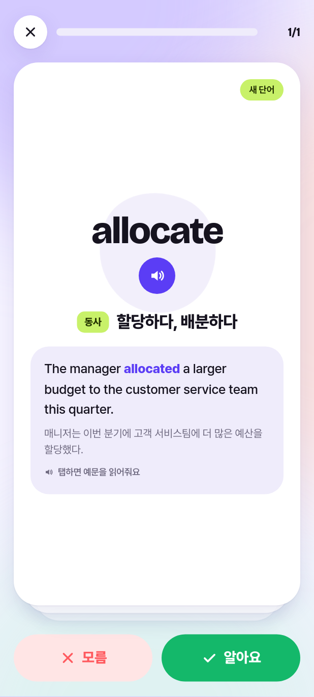
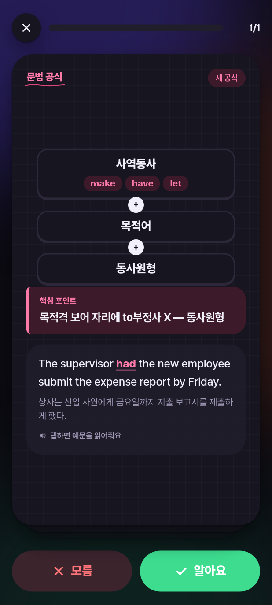
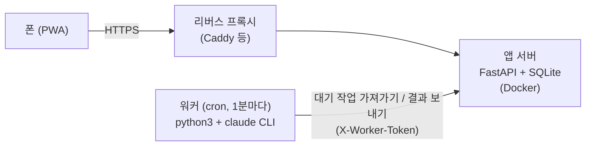

# 밑줄 (mitjul)

**책에 그은 줄이 단어 카드가 되는 토익 단어장.**

토익 교재에 **파란 펜**으로 모르는 단어를, **빨간 펜**으로 문법을 표시하고 사진을 찍어 올리면,
AI(Claude)가 표시를 찾아 뜻·품사·예문이 붙은 카드로 만들어 줍니다. 카드는 산타 토익 어휘 화면처럼
좌우로 스와이프하며 외우고, 간격 반복으로 다시 나옵니다.

집 서버에 직접 띄워 쓰는 **셀프호스팅 개인용 PWA**입니다.

<p>
  
  
  
  
  
</p>

## 기능

- **사진 → 카드 자동 생성**
  - 🔵 파란 펜 표시 → 어휘 카드 (사전형 표제어, 품사, 토익 뜻, 새로 만든 토익 스타일 예문과 번역)
  - 🔴 빨간 펜 표시 → 문법 공식 카드 (`사역동사(make/have/let) + 목적어 + 동사원형` 같은 한 줄 공식,
    핵심 포인트, 예문). 같은 규칙은 같은 표기로 맞춰 중복을 막는다
  - 공식으로 정리할 수 없는 표시는 건너뛰고 이유를 알려 준다
- **스와이프 학습**: 오른쪽 = 알아요, 왼쪽 = 모름. 모르는 카드는 세트 끝에 다시 나온다
- **간격 반복**: 알아요 → 1·3·7·14·30·60·120일 뒤 복습
- **발음**: 단어·예문을 탭하면 읽어 준다 (브라우저 내장 TTS, 외부 호출 없음)
- **직접 추가**: 단어나 문법 공식만 입력하면 AI가 나머지를 채운다
- 단어장 검색·편집, 연속 학습일, 라이트/다크 테마, 스플래시, Android 햅틱, 뒤로가기 처리

## 구조



- **앱 서버** (`app/`): API, 정적 PWA, SQLite DB, 업로드 사진. 빌드 도구 없는 순수 HTML/CSS/JS.
- **워커** (`worker/`): [Claude Code](https://code.claude.com) CLI가 로그인된 머신에서 cron으로 돈다.
  앱 서버에서 작업을 **가져가는(pull)** 방식이라 워커 쪽은 포트를 열 필요가 없다. 표준 라이브러리만 쓴다.
- 워커는 **자기 Claude 계정**으로 `claude -p`를 실행한다(도구는 `Read`만 허용). 이 앱은 여러분 자신이
  쓰는 개인용이다 — 다른 사람에게 서비스로 제공하면서 본인의 Claude 구독을 쓰게 하지 말 것.

## 설치

### 1. 앱 서버

```bash
git clone https://github.com/KimLightSource/Mitjul.git && cd Mitjul
cp .env.example .env && chmod 600 .env
# .env 의 VOCAB_WORKER_TOKEN 을 무작위 값으로 바꾼다: openssl rand -base64 32
docker compose up -d --build
curl http://localhost:8000/api/health   # {"ok":true}
```

데이터는 `./data`(SQLite `vocab.db` + `uploads/`)에 쌓인다. 백업은 이 디렉터리를 챙기면 된다.

### 2. HTTPS

폰에 **앱으로 설치**하려면(서비스 워커) HTTPS가 필요하다. 리버스 프록시 뒤에 둔다. Caddy 예시:

```caddyfile
vocab.example.com {
	reverse_proxy 127.0.0.1:8000
}
```

공인 인증서를 받을 수 없는 내부 도메인이라면 `tls internal`(사설 CA)을 쓰고, 폰에 그 CA의
**공개** 루트 인증서를 설치한다. `.env`에 `VOCAB_CA_CERT`(컨테이너 안 경로)와 `VOCAB_CA_URL`
(HTTP로 받을 수 있는 주소)을 넣으면 앱이 `/ca.crt`로 제공하고, 설치가 안 될 때 안내에 표시한다.

> ⚠️ 사용자 API에는 로그인이 없다(개인용 전제). **인터넷에 그대로 노출하지 말고** 집 네트워크나
> VPN(Tailscale 등) 안에서만 쓴다.

### 3. 워커

Claude Code CLI를 설치·로그인한 머신에서:

```bash
mkdir -p ~/.config/vocab ~/logs
cp worker/worker.env.example ~/.config/vocab/worker.env && chmod 600 ~/.config/vocab/worker.env
# VOCAB_URL 과 VOCAB_WORKER_TOKEN(.env 와 같은 값)을 채운다
python3 worker/vocab_worker.py          # 한 번 돌려 보기 (작업이 없으면 조용히 끝남)
crontab -e
# * * * * * /usr/bin/python3 /path/to/mitjul/worker/vocab_worker.py >> ~/logs/vocab-worker.log 2>&1
```

cron에서는 브라우저 로그인 세션이 만료되기 쉽다. `claude setup-token`으로 장기 토큰을 받아
`~/.config/claude-headless.env`(0600)에 `CLAUDE_CODE_OAUTH_TOKEN=<토큰>`으로 두면 워커가 읽는다.
claude 인증이 실패하면 작업을 지우지 않고 대기열에 되돌린 뒤 15분 쉰다.

### 4. 폰에 설치

Android **Chrome**으로 접속 → 메뉴 → **앱 설치**. (삼성 인터넷으로 설치하면 시작 화면이 어색하게 나온다.)

## 설정

| 위치 | 변수 | 설명 |
|---|---|---|
| `.env` | `VOCAB_WORKER_TOKEN` | **필수.** 워커와 공유하는 비밀 토큰 |
| `.env` | `VOCAB_PORT` | 호스트 포트 (기본 8000) |
| `.env` | `VOCAB_CA_CERT`, `VOCAB_CA_URL` | 선택. 사설 CA 공개 인증서 제공·안내 |
| `worker.env` | `VOCAB_URL`, `VOCAB_WORKER_TOKEN` | 앱 서버 주소와 토큰 |
| `worker.env` | `VOCAB_MODEL` | 워커가 쓸 모델 (기본 `sonnet`, 인식이 아쉬우면 `opus`) |

프롬프트는 `worker/prompt.md`, 아이콘 생성은 `tools/make-icon.py`.

## 라이선스

[MIT](LICENSE)
